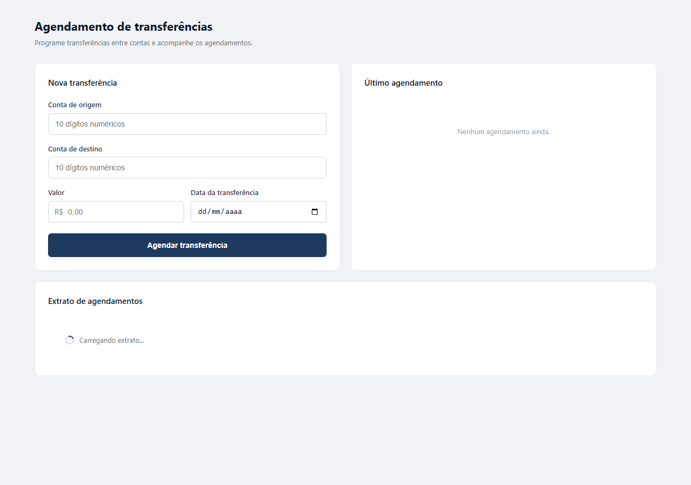

# tokio-desafio-java

Projeto desenvolvido como parte de uma avaliação tecnica para processo seletivo da Tokio Marine.

A aplicação permite o agendamento de transferências financeiras, calcula automáticamente a taxa aplicável de acordo com a data escolhida para a transferência e permite consultar o extrato dos agendamentos cadastrados.


## Técnologias

### Backend

- Java 11
- Spring Boot 2.7.18
- Maven
- Spring Web
- Spring Data JPA
- Bean Validation
- H2 Database
- Lombok
- JUnit 5
- Mockito

### Frontend

- Angular 21 (standalone components)
- TypeScript
- Reactive Forms
- Angular HttpClient (proxy para o backend)
- CSS puro (responsivo, sem bibliotecas externas)

## Tela principal



## Decisões arquiteturais

O backend foi organizado em Layered Architecture:

```text
controller  -> endpoints REST, DTOs e mappers da API
service     -> casos de uso e regras de negocio
model       -> dominio puro da transferencia agendada
repository  -> persistencia, entidade JPA e mapper de banco
exception   -> tratamento padronizado de erros
```

Principais decisoes:

- `ScheduledTransfer` foi mantida como objeto de dominio, separado da entidade JPA.
- `ScheduledTransferEntity` representa a tabela no banco H2.
- `ScheduledTransferMapper` converte entre dominio e persistencia.
- `ScheduledTransferControllerMapper` converte dominio para resposta da API.
- O cálculo da taxa foi isolado em `TransferFeeCalculator`.
- Valores financeiros usam `BigDecimal`.
- Erros da API sao padronizados por `GlobalExceptionHandler`.


## Como executar o backend

Entre na pasta do backend:

```bash
cd Backend
```

Execute a aplicação:

```bash
mvn spring-boot:run
```

A API sobe em:

```text
http://localhost:8082
```

Console do H2:

```text
http://localhost:8082/h2-console
```

Dados do H2:

```text
JDBC URL: jdbc:h2:mem:tokiodb
User: sa
Password: deixe vazio
```

## Como executar os testes

Na pasta `Backend`, execute:

```bash
mvn test
```

## Endpoints

```text
POST /scheduled-transfers
GET  /scheduled-transfers
```

## Exemplos com curl

Os exemplos abaixo consideram que a API esta rodando em `http://localhost:8082`.

Observacao: as datas dos exemplos foram montadas considerando a execucao em `2026-05-24`. Se executar em outro dia, ajuste `transferDate` para ficar dentro ou fora das faixas desejadas.

### Agendar transferencia valida

```bash
curl -X POST http://localhost:8082/scheduled-transfers \
  -H "Content-Type: application/json" \
  -d '{
    "sourceAccount": "1234567890",
    "destinationAccount": "0987654321",
    "amount": 1000.00,
    "transferDate": "2026-06-03"
  }'
```

Resposta esperada:

```json
{
  "id": 1,
  "sourceAccount": "1234567890",
  "destinationAccount": "0987654321",
  "amount": 1000.00,
  "fee": 12.00,
  "totalAmount": 1012.00,
  "transferDate": "2026-06-03",
  "schedulingDate": "2026-05-24"
}
```

### Consultar extrato

```bash
curl http://localhost:8082/scheduled-transfers
```

Resposta esperada:

```json
[
  {
    "id": 1,
    "sourceAccount": "1234567890",
    "destinationAccount": "0987654321",
    "amount": 1000.00,
    "fee": 12.00,
    "totalAmount": 1012.00,
    "transferDate": "2026-06-03",
    "schedulingDate": "2026-05-24"
  }
]
```

## Como executar com Docker

Na raiz do projeto, execute:

```bash
docker-compose up --build
```

O Docker Compose sobe o backend e, assim que ele estiver saudável, sobe o frontend:

```text
Frontend → http://localhost:80
Backend  → http://localhost:8082
```

---

## Como executar o frontend

Entre na pasta do frontend:

```bash
cd Frontend/tokio-transfer-app
```

Instale as dependências (apenas na primeira vez):

```bash
npm install
```

Execute a aplicação:

```bash
npm start
```

O frontend sobe em:

```text
http://localhost:4200
```

As chamadas para `/api/*` são redirecionadas automaticamente para `http://localhost:8082` via proxy de desenvolvimento. É necessário que o backend esteja rodando para que o frontend funcione.

## Arquitetura do frontend

```text
src/app/
├── models/
│   └── transfer.models.ts        # Interfaces: Request, Response e ApiError
├── services/
│   └── scheduled-transfer.service.ts  # Chamadas HTTP ao backend
└── pages/
    └── transfer-scheduling/
        ├── *.component.ts        # Lógica, Reactive Forms e tratamento de erros
        ├── *.component.html      # Template
        └── *.component.css       # Estilos responsivos
```

Principais decisões:

- Componente único com formulário, resumo e tabela na mesma tela.
- Proxy de desenvolvimento configurado em `proxy.conf.json` evita CORS em desenvolvimento.
- Validações no frontend: campos obrigatórios, exatamente 10 dígitos por conta, conta origem ≠ destino.
- Erros da API exibidos por campo (`fieldErrors`) ou como alerta geral (`message`).
- Locale `pt-BR` registrado globalmente para formatação de moeda e datas.

## Possíveis melhorias

Alguns pontos foram deixados fora do escopo inicial para manter a solução objetiva, mas seriam evoluções naturais para uma próxima etapa:

- Implementar idempotência no agendamento de transferências, evitando duplicidade caso o cliente envie a mesma requisição mais de uma vez por instabilidade de rede ou timeout.
- Criar cadastro de usuários e autenticação, vinculando os agendamentos ao usuário autenticado e permitindo que cada pessoa visualize apenas o próprio extrato.
- Substituir o banco H2 em memória por um banco persistente, como PostgreSQL ou MySQL, mantendo scripts de migração com Flyway ou Liquibase.
- Adicionar paginação e ordenação no endpoint de extrato, principalmente para cenários com muitos agendamentos.
- Melhorar observabilidade com logs estruturados, métricas e rastreamento de erros.
- Ampliar a cobertura de testes de integração entre API, banco e regras de negócio.
